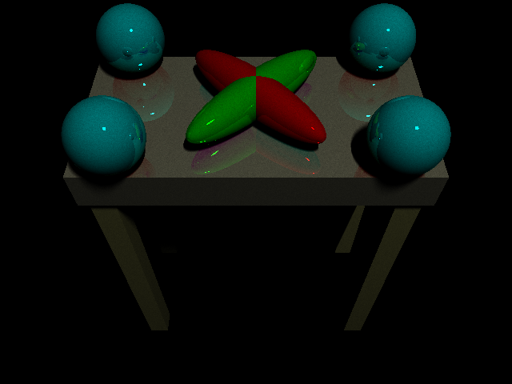
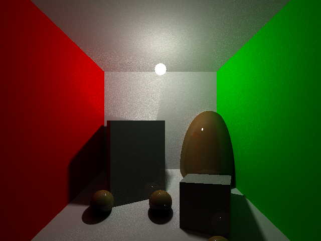
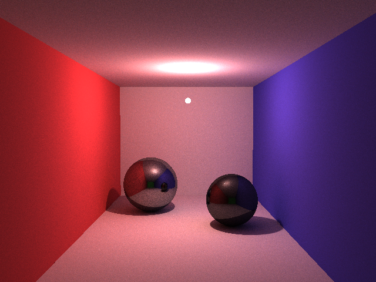

# CSE 167 Final Project - Path Tracing Extra Credit

Features implemented:
- Path tracing
- A new command, `method {ray|path [samples per pixel]}`, to control which rendering method is used to draw the scene.
- Spherical lights for soft shadows
- 8x speedup for path tracing, using parallelization via openMP.

Materials can be both diffuse and specular:

Soft shadows occur naturally due to the use of spherical lights. Specular materials create highlights on nearby surfaces.

Other images:

